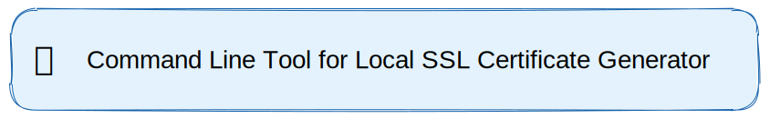

# Local SSL

  
	 
	 

This project is a helper command line tool, that
generates an RSA (DES3 ciphered) private key and an sha256
encrypted public key.

> :warning: **NOTE**: This Project requires you to have `openssl` already installed
> on your OS

Help taken from - [freeCodeCamp](https://www.freecodecamp.org/news/how-to-get-https-working-on-your-local-development-environment-in-5-minutes-7af615770eec/)

## Improvements

* Add [Clap](https://github.com/clap-rs/clap) support if needed
* Add Log Colors, usin [Paris](https://github.com/0x20F/paris).

## References

* A great read to understand OpenSSL implementations - [StackOverflow](https://stackoverflow.com/a/15082282/2849127)

* [OS specific Keychain creations for Self Signed Certificates](https://support.kerioconnect.gfi.com/hc/en-us/articles/360015200119-Adding-Trusted-Root-Certificates-to-the-Server)

* Learn About Macros:
  * List of useful *designators*: https://doc.rust-lang.org/rust-by-example/macros/designators.html
